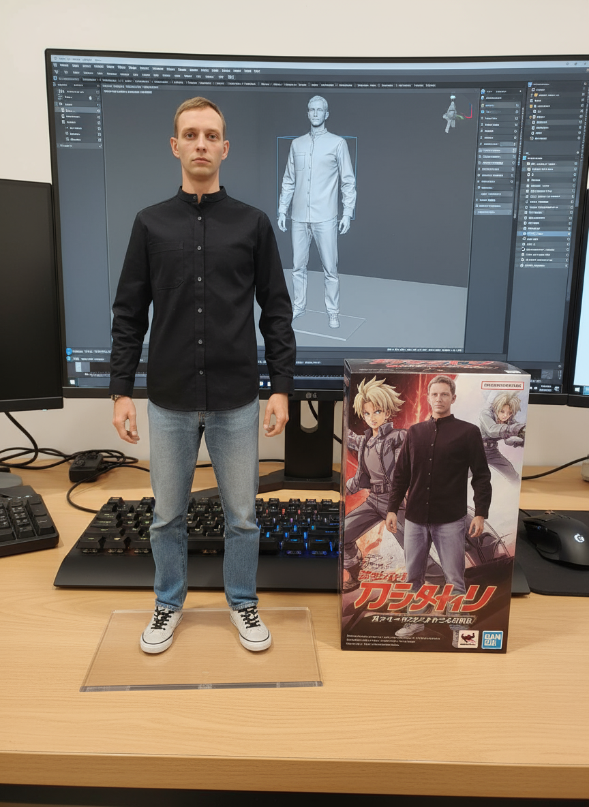

# Привет, я Вадим! 👋

## Обо мне
Я разработчик/дизайнер/специалист с интересом к современным технологиям. 
В настоящее время учусь на курсе в Нетологии и развиваю навыки в веб-разработке.

## Мои навыки
- JavaScript
- Python
- Git и GitHub
- HTML & CSS
- Работа с базами данных

## Проекты
- **Проект 1:** Работа)
- **Проект 2:** Учеба и развитие))

## Как со мной связаться
- Email: neo-vadim-s@mail.ru
- GitHub: https://github.com/neovadimserterrtutu-lab

## Интересы
Люблю разработку, фотографию и новые технологии.

---

*Последнее обновление: Декабрь 2025*